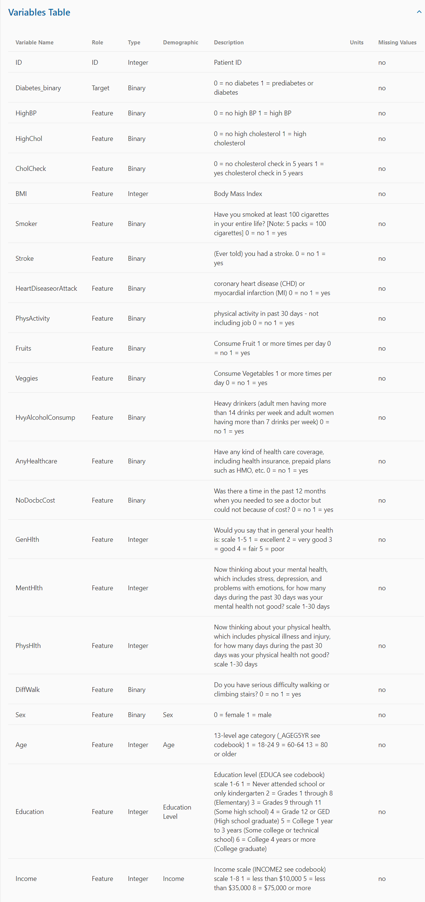
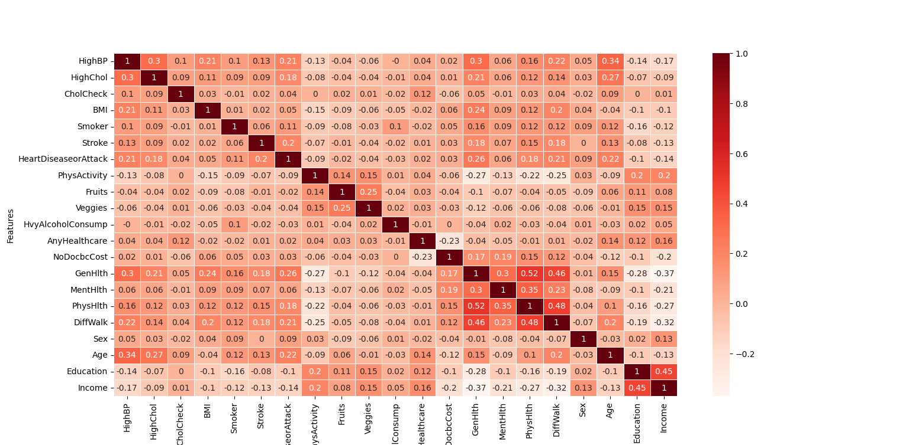
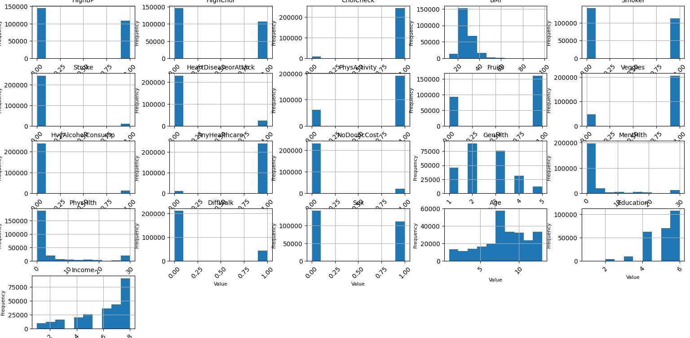

# Diabetes Risk Analysis

## Table of Contents

1. [Introduction](#introduction)
2. [Dataset](#dataset)
3. [Prerequisites](#prerequisites)
4. [Getting Started](#getting-started)
5. [Analysis](#analysis)
6. [Predictive Analysis on New Datasets](#predictive-analysis-on-new-datasets)
7. [Results](#results)
8. [Contributing](#contributing)
9. [License](#license)

## Introduction

This project aims to analyze a dataset from the CDC to understand the relationship between lifestyle and diabetes in the US. The dataset is utilized for Correlation Analysis, Demographic Analysis, and Predictive Analysis.

## Dataset

### Overview

**CDC Diabetes Health Indicators Dataset**

This dataset, linked on 9/25/2023, contains healthcare statistics and lifestyle survey information about individuals, along with their diabetes diagnosis status. The dataset comprises 35 features, including demographics, lab test results, and responses to survey questions for each patient. The target variable for classification is the diabetes status of a patient, categorized as diabetic, pre-diabetic, or healthy.

### Dataset Characteristics

- **Format:** Tabular, Multivariate
- **Subject Area:** Health and Medicine
- **Associated Tasks:** Classification
- **Feature Types:** Categorical, Integer
- **Instances:** 253,680
- **Features:** 21

### Additional Information

- [Dataset Type Information](https://archive.ics.uci.edu/dataset/891/cdc+diabetes+health+indicators)
- The dataset also includes information about diabetes diagnosis, demographics (race, sex), personal information (income, education), and health history (drinking, smoking, mental health, physical health).
- Class Labels: Diabetes, Pre-diabetes, Healthy
- [Access Dataset Here](https://www.cdc.gov/brfss/annual_data/annual_2014.html)

### Introductory Paper

The dataset is associated with the paper "Incidence of End-Stage Renal Disease Attributed to Diabetes Among Persons with Diagnosed Diabetes — United States and Puerto Rico, 2000–2014" by Nilka Rios Burrows, MPH; Israel Hora, PhD; Linda S. Geiss, MA; Edward W. Gregg, PhD; Ann Albright, PhD, published in 2017 in the Morbidity and Mortality Weekly Report.

## Prerequisites

- Python 3.6 or higher
- Pip for installing dependencies

## Getting Started

1. Download the dataset from the link provided above.
2. Clone this repository to your local machine.
3. Install the required Python packages using the following command: `pip install -r requirements.txt`
4. Run the main script using the following command: `python main.py`

## Analysis

1. **Correlation Analysis**: Understand the relationship between different lifestyle factors and the risk of diabetes.
2. **Demographic Analysis**: Explore how the risk of diabetes varies across different demographic groups.
3. **Predictive Analysis**: Use machine learning algorithms to predict whether a person is likely to have diabetes based on their lifestyle and demographic information.

## Predictive Analysis on New Datasets

- The model trained on the diabetes dataset can be used to make predictions on new datasets. It is saved in the root folder.
- To perform predictive analysis, run the `perform_predictive_analysis` function in the `predictive_analysis.py` file.
- This function trains a Random Forest Classifier on the diabetes dataset and saves the trained model to a file.
- To use the trained model to make predictions on new data, run the `predict_new_data` function in the `predictive_analysis.py` file. 
- This function loads the trained model and uses it to make predictions on the new data. The new data should be in a CSV file and preprocessed in the same way as the training data.

## Diabetes Risk Analysis Results

### Heatmap

The heatmap visually represents the correlation between different lifestyle factors and the risk of diabetes. Darker shades indicate stronger correlations, providing insights into which factors may contribute more significantly to diabetes risk.

### Histogram

The histogram illustrates the distribution of diabetes risk across the dataset. It helps in understanding the prevalence of different risk levels and can aid in identifying patterns or trends within the data.

## Contributing

- Contributions are welcome. Please open an issue to discuss your idea or submit a pull request.

## License

- This project is licensed under the MIT License. See the [LICENSE](LICENSE) file for details.
